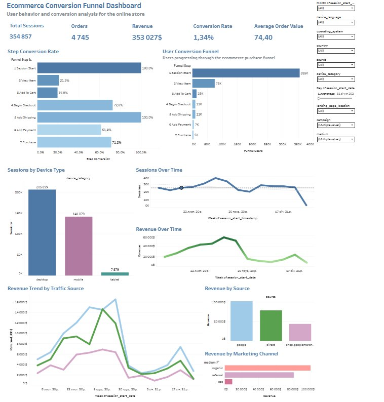

# Ecommerce Conversion Dashboard (GA4 + Tableau)

  

## 📊 Project Overview
This project analyzes the ecommerce conversion funnel using Google Analytics 4 (GA4) data.

The goal is to identify where users drop off and improve conversion rates.

## 🎯 Business Goal
- Analyze user behavior across the funnel
- Identify bottlenecks in conversion
- Improve purchase rate

## 🧰 Tools Used
- SQL (BigQuery)
- Tableau
- GA4 dataset

## 📈 Key Metrics
- Sessions
- Conversion rate
- Add to cart rate
- Checkout completion rate
- Revenue

## 🔍 Analysis
The funnel includes:
- session_start
- view_item
- add_to_cart
- begin_checkout
- purchase

## 📊 Dashboard
👉 [View Tableau Dashboard] (https://public.tableau.com/views/EcommerceConversionDashboard_17729882212460/Dashboard1?:language=en-US&:sid=&:redirect=auth&:display_count=n&:origin=viz_share_link)

## 🎥 Presentation
👉 [Watch Project Walkthrough] (https://www.loom.com/share/e88a9e6f782448efba5b2f6c6ae6389e)
## 📄 Presentation

👉 [View Presentation](presentation/project_overview.pdf)
## 💡 Key Insights
- Most users drop off at add_to_cart stage
- Mobile users have lower conversion rate
- Traffic source significantly impacts purchase rate

## 📌 Conclusion
Optimizing the checkout process and improving mobile UX can significantly increase conversions.
